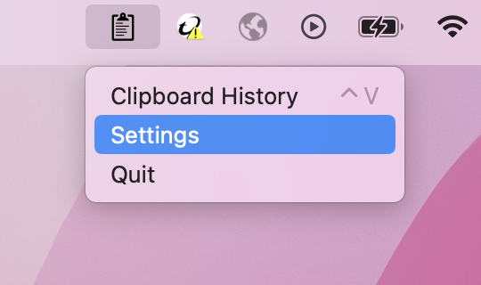

# Clipstory - clipboard history for macOS
> *[Download Latest Release](https://github.com/Pingu1337/Clipstory/releases/tag/latest)*

# Table of contents
1. [About](#about)
2. [Installation and Usage](#about)
3. [Contribute](#contribute)
3. [License](#license)

# About
Clipstory is a clipboard history manager for macOS. 
The application lives as a tray icon in the menu bar and the clipboard history can be accessed by pressing the hotkey.

Clipboard history is saved to a file and not stored in memory, so it can be remembered even if you log out or restart the computer.

# Installation and Usage

## Installing the application
First [download the installer](https://github.com/Pingu1337/Clipstory/releases/tag/latest) and install it.

Once installed you will need to grant the app permission to "control the computer".\
 1. Navigate to `System Settings > Security and Integrity > Accessability` 
 2. Click the `+` button and select **Clipstory** from the list.

To run Clipstory automatically on startup there are a few more steps: 
1. Navigate to `System Settings > General > Login Items`
2. Click the `+` button and select **Clipstory** from the list.

## Usage
Pressing the hotkey (**^V** / **ctrl+V**) brings up a list of you last clips, simply click on the one you want to paste and it will be pasted. When you paste from Clipstory the clip will also be added to the *"real clipboard"* accessed with (**⌘V**). 

## Settings
To access the settings click on the Clipstory icon in the menu bar.
<!---->

> ### The settings explained:
> - **Max clipboard history count** –– *the maximum amount of clips saved in in history*
>   - *default*: **20**
>   - *max*: **99**
> - **Save history across sessions** –– *remember clipboard history when you log out*
>   - default: **true**

# Contribute

## Prerequisites

1. [install homebrew](https://brew.sh/)
2. *install python:*  `brew install python`
3. *install pipenv:* `python3 -m pip install pipenv`

## Setting up
- *clone the repo:* `git clone https://github.com/Pingu1337/Clipstory.git`
- `cd Clipstory`
- *install packages from pipfile:* `pipenv install`
- *run the app:* `pipenv run python tray.py`

# License
Clipstory is licensed under the [**MIT License**](LICENSE)
